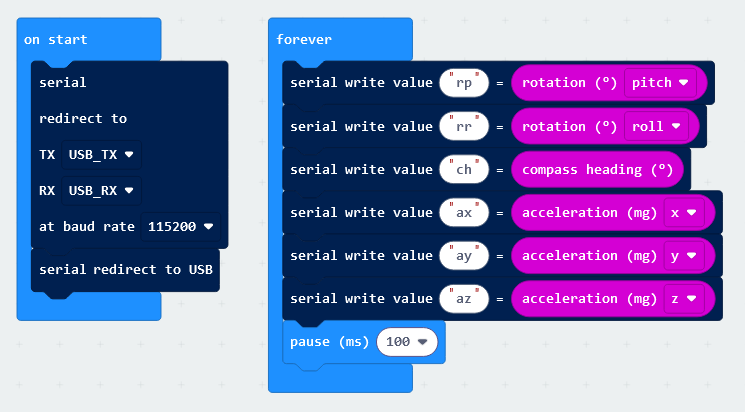
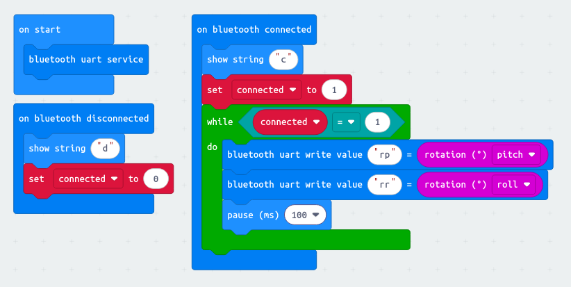

# micro:bit blender remote thing?

<video src="assets/demo.mp4" width=180></video>

2 files come with this:
 - `blender.py` intended to just be loaded up in blender
 - `blendernt.py` bug testing, not relying on any blender stuff

to install, you must:
 - compile this script from [makecode](http://makecode.microbit.com)...
 - 
 - 
 - install `pyserial` and make sure it's accessible by blender in `{PATH_TO_INSTALL}/Blender/{VERSION}/scripts/modules/serial/...`
 - open the scripting panel, and just paste the `blender.py` file into it, remember to change the `COM4` to whatever, like `/dev/ttyACM0` or whatnot
 - toggle the extension in the panel

now you can watch whatever object you have selected, wriggle around helplessly, the micro:bit does not have a great range of motion :P
